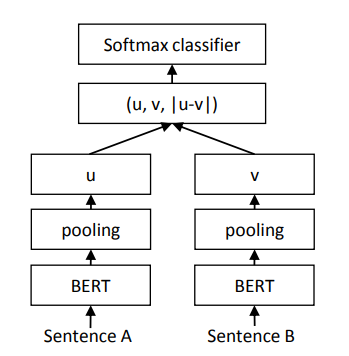
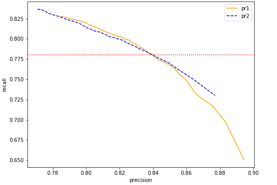

# Bert语义识别相关工作总结

#### 实验平台

192.168.23.90

#### 使用说明

##### 数据准备

+ 训练集样例：

  ```
  processid,in_node,msg,corpus,out_node,out_true,msg_type,corpus_type,target
  benrenshoucui,4.2,喂我一共是,就是,6.1,-99,无效语义,肯定,0
  benrenshoucui,2.1,什么地方呀,什么公司,z_askcompany,z_askcompany,询问机构,询问机构,1
  ```

+ 测试集样例：

  ```
  processid,in_node,msg,corpus,out_node,out_true,msg_type,corpus_type,target
  RESC,1.1,什么东西啊,你是做什么的,z_1520,-99,无效语义,询问机构,0
  GHSC,1.1,反正啥货允试试,我压根没用这张卡,z_1339,-99,无效语义,卡片遗失,0
  ```

##### 代码运行

```sh
source /opt/anaconda3-5.1.0/bin/activate  # 激活虚拟环境
cd bert_siamese
sh run.sh
```

运行之前需要修改run.sh中的参数参数：

+ --data_dir：放训练数据的目录
+ --vocab_file、--bert_config_file、--init_checkpoint：预训练Bert模型的路径
+ --output_dir：输出模型和结果的目录
+ --train_data：训练集路径
+ --predict_data：测试集路径


#### 孪生网络匹配模型

##### 原始数据

+ 训练集：`/home/zhaoxi.li/bert/data/msg.csv`，127479条message
+ 测试集：`/home/zhaoxi.li/bert/data/test_20000.csv`，20000条message
+ 语料库：`/home/zhaoxi.li/bert/data/corpus.csv`，6266条corpus

##### 任务目标

给定一条message，在语料库中找到最匹配的corpus，将这条corpus的意图作为该message的预测意图。

##### 样本生成

给定一条corpus，根据其意图`type`和节点树可以得到该corpus可能位于该节点树中的哪些节点上。给定一条message，根据其入节点`in_node`，筛选出可能与其入节点相同的corpus。

将message与所有可能的corpus计算句向量的相似度，把相似度大于一阈值的corpus拿出来与message生成候选集（这一过程称为粗排）；如果候选集中corpus小于10条，则把相似度排名前10的corpus作为候选集。

将message与候选集中的corpus两两配对，对于匹配对得到的每一条样本，如果出节点相同`out_node=out_true`，则将这条样本的便签标记为1，反之为0。

##### 评估策略

+ Accuracy：所有message中预测正确的比例（包括有效语义及无效语义）
+ Recall：所有真实值不为无效语义的message中，判断出节点正确的比例
+ Precision：所以预测不为无效语义的message中，判断出节点正确的比例

##### Baseline

样本生成时使用之前线上的word2vec模型，将词向量加权平均后得到句向量，粗排阈值为0.75。数据在

`/home/zhaoxi.li/bert/data_no_repeat/train.csv`和`/home/zhaoxi.li/bert/data_no_repeat/test.csv`。使用孪生网络模型，将message和corpus分别输入两个共享参数的Bert模型，得到[CLS]的向量作为两个句子的句向量，并计算余弦相似度。随后使用对比损失 (Contrastive Loss) 作为损失函数：
$$
L = \frac{1}{2N}\sum_{n=1}^N(yd^2+(1-y)\max(\text{margin}-d,0)^2)
$$
预测时选取候选集中余弦相似度最大的corpus的出节点作为预测的出节点，如果最大的相似度小于一个阈值，则将该条message判断为无效语义。

阈值卡0.75，Accuracy、Recall、Precision分别为


#### 实验记录

+ Bert粗排

  在粗排阶段，使用Bert模型代替word2vec模型计算句向量，这里的Bert是pretrain的原始模型，将最后一层输出的每个词的向量取平均作为句向量，由于Bert计算出来的句向量相似度比较高，所以把粗排的阈值设为0.87。

  下表为不同的阈值和句向量策略对应的**命中率**（候选集中有真值的概率）

  |              | threshold | train_count | test_count | train_hit  | test_hit   |
  | ------------ | --------- | ----------- | ---------- | ---------- | ---------- |
  | origin-norep | 0.75      | 1696634     | 257629     | 0.9210     | 0.9221     |
  | word2vec     | 0.75      | 1796461     | 257599     | 0.9207     | 0.9205     |
  | mean(-2)     | 0.92      | 1712729     | 259200     | 0.9262     | 0.9410     |
  | **mean(-1)** | 0.87      | 1771056     | 269380     | **0.9282** | **0.9430** |
  | mean(-1)     | 0.88      | 1492110     | 230289     | 0.9249     | 0.9398     |
  | mean(-1)     | 0.92      | 1274665     | 199975     | 0.9212     | 0.9349     |
  | cls(-1)      | 0.91      | 1991348     | 319025     | 0.9219     | 0.9349     |
  | cls(-1)      | 0.95      | 1274641     | 199972     | 0.9139     | 0.9231     |
  | cls(-2)      | 0.95      | 1446246     | 225073     | 0.9082     | 0.9197     |

  使用Bert粗排的训练集和测试集样本数分别 为1771056 和 269380，使用原孪生网络模型训练一轮，阈值卡0.75，结果为0.8494，0.7998，0.8231


+ 扩充语料库

  原始语料库中有6266条corpus，可能会有message在粗排后命中不了corpus，所以对语料库进行扩充。

  先后尝试了四种添加语料策略，相关代码在`generate_dataset/add_corpus.py`

  + 全量添加：在训练集的127479条message中，有14179条message找不到相似度大于0.85的同出节点corpus，全量添加即将这14179条加入到语料库中。效果不佳

  + 增量添加：对于这14179条message，每添加一条message到语料库，重新计算所有的message与corpus的匹配情况，再将下一条没有匹配的message添加进语料库；不断循环直至所有的message都能匹配成功。相似度卡0.85共添加4456条新语料。效果不佳

  + 贪心算法：在所有14179条未匹配的message中，两两计算相似度，并计算将其中一条message添加进语料库之后，能够被该条message匹配到的其他message的条数。循环迭代，每次取能新匹配到最多message的那条message添加到语料库中。效果优于全量、增量，但仍然不理想

  + 贪心算法+惩罚：添加新corpus时，可能会有新的corpus与无效语义message比较相似，导致后续预测时将无效语义预测为有效语义。所以选择message时考虑该条message与无效语义message的相似程度。尝试了$a-2b$、$a-b$、$a / (b+0.01)$、$a / (b+1)$、$a / (b+5)$，$a$为新匹配有效语义的条数，$b$为匹配无效语义的条数。效果最好的是$a/(b+0.01)$ 加100条，与不加语料差不多

  + **去叠词+贪心+惩罚**：新添加的预料质量较低，有很多叠字叠词，所以分词去叠词后再添加新语料。去叠词后加500条语料效果最好，文件路径：`/home/zhaoxi.li/bert/data//home/zhaoxi.li/bert/data/test_bert_mean_1_85_tokenize_add1.csv`：

    

    0.75  0.851934  0.811726   0.818984

    （只需在扩充语料时对message去叠词，粗排和输入Bert之前不要去叠词，否则效果很差）

  + 缩减语料库：不添加新的语料库，而是删除原语料库中与无效语义message匹配程度较高的corpus，效果不佳。

  

+ Triplet

  Triplet Network是指输入一组三元组$<a,p,n>$，message $a$ 和corpus $p$ 同进同出，message $a$ 和corpus $n$ 同进不同出，损失函数的目标$a$和$p$尽可能接近，使$a$和$n$尽可能远离。相关代码在`bert_siamese/run_triplet.py`

  Triplet三元组的生成策略：在粗排生成的候选集中，正样本与负样本之间两两生成三元组，对于无效语义，则把自己作为正样本。

  初始的Triplet Loss：
  $$
  L=max(d(a,p)−d(a,n)+margin,0)
  $$
  这里距离取的是余弦距离，范围在0-2之间，此时margin设为0.8效果最佳，但效果略差于孪生网络。 

  

+ 分类孪生网络

  参考论文：Reimers N, Gurevych I. Sentence-BERT: Sentence Embeddings using Siamese BERT-Networks[C]//Proceedings of the 2019 Conference on Empirical Methods in Natural Language Processing and the 9th International Joint Conference on Natural Language Processing (EMNLP-IJCNLP). 2019: 3973-3983.

  

将message和corpus分别输入同一Bert模型，分别两个[CLS]的向量作为表示向量$u$和$v$，然后将$<u,v,|u-v|,u\cdot v>$拼接起来输进全连接层，输出message和corpus出节点相同的概率，损失函数为交叉熵。

代码在`bert_siamese/run_siamese.py`里的`ClassificationLoss`




结合增加语料库和分类损失函数两种策略，最终优化结果为：

0.85 0.851215  0.812386   0.818619

